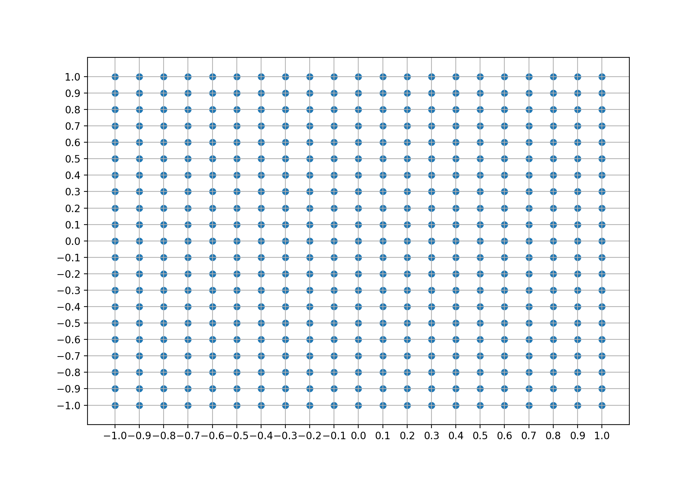

**Goals.**
The goal of this computer lab is that you train a segmentation model,
fitting its parameters to empirical data, and evaluate its performance.
The model that you will train is the Retention&Recognition model (RnR
henceforth). You can find a short description of the model in
@alhama2015should and in the slides in the `materials/` directory.
We will use the data and evaluation procedures described in
@frank2010modeling.

**Requirements.**
You need to write and run codes in python and the
core libraries that you will use are: `matplotlib`, `random`, `numpy`,
`scipy`. If you don’t have these libraries installed you can install
them using `pip` or `conda`.
In case you are not very familiar with drawing plots in python, you
might find [this `matplotlib` gallery](http://matplotlib.org/gallery.html) helpful.

**Materials**
In the `materials/src` directory, you can see 7 `*.py` files.
These contain the computational model that you will train,
the methods to load the empirical data and objects and methods
for defining experiments. You don’t need to
understand what happens in these files but you can use the functions and
classes defined in these files to do this assignment. You will need to
use functions defined in for fitting the RnR model with the and
algorithms. The main file from which you will be running your code is .
This is where you should load the data, instantiate the RnR model and
call your optimization functions to train the model.
Finally, the file contains an example model that will be described
later.

In the `materials/data` directory, you can find three files, each one containing
human responses for each of the three experiments described in
@frank2010modeling. The name of the file indicates which experiment it
corresponds to.

**Handing in.**
You should deliver a pdf report including the **plots** and
**explanations**, and **codes** that you wrote (This could be the pdf
version of your notebook) along with the ipython notebook you have
worked on and all **source files that you have edited**.

Introduction
=============================

The data
--------

As mentioned before, the goal of this assignment is for you to train and
evaluate a computational model for segmentation in Artificial Language
Learning. You are provided with the model (the RnR model mentioned
above, and seen in the slides), and your task is to fit the parameters
of this model (train the model) on the dataset that is provided.

@frank2010modeling present three experiments to
study how different factors affect word segmentation. These factors are:

- **Sentence length**\
    This is experiment number 1. In this experiment the number of
    tokens and the size of the vocabulary are fixed. The
    sentence length is set to be 1, 2, 3, 4, 6, 8, 12 or 24.

- **Number of tokens**\
    This is experiment number 2. In this experiment the size of the
    vocabulary and sentence length are fixed. The total number of
    tokens in the input stream is set to be 48, 100, 300, 600, 900 or 1200.

- **Size of the vocabulary**\
    This is experiment number 3. In this experiment the number of
    tokens and the length of the sentence are fixed. The
    vocabulary size is set to be 3, 4, 5, 6 or 9.

In each experiment the input stream is generated pseudo-randomly
to satisfy the specified criteria. After being exposed to this stream, 
the participants answer a 2AFC test in which they
choose between words and partwords. These responses are collected in
three data files. You can find these files in `materials/data` directory
(`E1_data.csv`, `E2_data.csv`, `E3_data.csv`).

To see what the input stream for experiment 1 looks like, you
can run the following code:

```python
expId = 1 # Change to 2 or 3 to see the input stream for experiment 2 or 3
exp = Frank2010.experiment(expId)
for cnd, expcnd in exp.cnd.items():
    print(Frank2010.CONDITION[expId] + ": " + str(cnd))
    print(expcnd.stream)
```

If you instantiate the experiment using `exp = Frank2010.experiment(expId)`, 
the data of human responses is
already loaded and you can access it as follows:

- `exp.expResults` is the loaded and processed human response data

- `exp.expResults.data` is a list of tuples containing the condition,
subject, and if he/she was correct or not

- `exp.expResults.performance` is performance of each subject for each
condition

- `exp.expResults.avg_performance` is average performance of all subjects
for each condition

- `exp.expResults.std_performance` is standard deviation of performance of
all subjects on each condition

- `exp.plotPerformance()` plots the responses of the humans in the
experiment

The model
---------

As mentioned above the RnR model is a probabilistic segmentation model.
Given a stream of syllables, it breaks it into segments. The model works
based on two probabilities, the recognition probability and the
retention probability. You can read more about this model in
@alhama2015should. The recognition and retention probabilities
of a segment $s$ are computed as follows:

$$
P_{\text{rec}}(s)  =  (1 - B^{\text{activation}(s)}) \cdot D^{\#\text{types}}
$$

$$
P_{\text{ret}}(s)  = A^{\text{length}(s)} \cdot  C^{\pi}
$$

As you can see. The model involves 4 parameters $A,B,C$ and $D$ that should
be fitted to the empirical data.

This is an example of how you can instantiate the RnR model in your
code, for a given parameter setting:

```python
rnr_model = RnR.RnRv2(A=0.04, B=0.3, C=0.3, D=0.3, nmax=4)
```

You can run the RnR model and see the words it memorizes by running this
code:

```python
for cnd, expcnd in exp.cnd.iteritems():
    memory = rnr_model.memorizeOnline("##".join(expcnd.stimuli))
    print memory
```

In order to test the performance of the model, after each input stream,
a list of pairs of sequences consisting of one word and one partword
will be given to the model, and it has to decide which of the sequences
is more likely to be a word.

These test pairs are stored in `expcnd.test`. The output of the RnR
model consists of a memory of segments, together with their subjective
frequencies. In order to convert that output to the probabilities of
choosing a test item, we use the Luce rule, which states that, given two
alternative options $s_1$ and $s_2$ to choose from (sequences in our
case), the probability to choose one over the other is:

$$P(s_1) = \frac{\text{score}(s_1)}{\text{score}(s_1)+\text{score}(s_2)}$$

where score is, in the case of the RnR model, a subjective frequency.
In the code, we call the Luce choice rule as follows:

```python
prob_x, prob_y, chosen = rnr_model.Luce(pair[0], pair[1])
```

In the `__main__` method of , you can find an example of use of the
classes and . Run the code and make sure you understand it before
proceeding (you don’t need to understand all code in the modules, just
how they can be used).

Model fitting
=============

Computational models normally include a set of free parameters. The
behaviour of the model changes depending on the values of such
parameters. Hence, after choosing a computational model, the next step
is to set the parameters of the model so that the behaviour/output of
the model is consistent/similar to the phenomenon that is being
modelled. This is what we call *training* or *fitting* the model.

Fitting a polynomial
--------------------

A very simplified classic example of this is when we have a set of
points and we want to fit a curve to these points. Say we decide that it
should be polynomial with the degree of 2. This gives us the following equation:

$$y = Ax^{2} + Bx + C$$

Here $A$, $B$ and $C$ are the parameters of the model. Now we have to
choose the values of these parameters in order to get a curve that best
approximates the data points.

But what do we mean by best approximation? This is what we define with
an *objective function*. The objective function is the function that you
try to minimize/maximize during the training phase. In other words, we
want to find the parameters values that result in the minimum/maximum
possible value for the objective function. That would provide us with
the best curve.

In this example, we can define the objective function as the mean of the
difference between real value $y$ of the points and the target
values $y'$, i.e. the $y$ calculated using the polynomial equation above.

One thing to consider is that, depending on the data points, it is not
always possible to find the set of parameters that gives us an objective
function with minimum possible value (zero in this case).

::: question 
In this example, what is the threshold number of data points
that would guarantee to have at least one set of parameters that result
in the objective function to be zero (i.e. in a curve that passes
through all the data points)?

**Hint 1:** If you have a model with $n$ parameters and you have $m$
data points, this gives you m equations with n variables (parameters).
If $m == n$ then you will find exactly one valid value for each variable
(parameter). If $m < n$ the equations would have more than 1 answer and
if $m > n$ there would be no solution at all.

**Hint 2:** Consider a linear model, $y = Ax + B$, where there are two
parameters. If you have one point, you can have infinite number of lines
that go through the point. If you have two points, there is only one
lines that passes both of the points. Then if you add a third point, if
it is not on the same line as the first two points, you can not have a
line that passes all the three points.
:::

Now, if we have the model, the objective function, and the data points,
how can we find the best set of values for the parameters?
The algorithms that are used to find the best set of values for the
parameters of a model are called *optimization* algorithms. In this
assignment, you will see two different optimization algorithm, Grid
Search and Hill Climbing.

Grid search
-----------

One very trivial way to find the optimal parameter setting is to compute
the objective function for all equidistant possible combinations of
different values for the parameters, and then choose the combination
that gives us the lowest cost [^1] This simple method is called Grid
Search.

In the example model, set $C$ to a random value, and assume $A$ and $B$ can be
any real value in the range $[-1,1]$. We have to pick a step size, let’s say 0.1.
(Since there are indefinite possible values we pick a step size in order to
pick a sample.) Thus we would have 21 possible values
for both $A$ and $B$:
$$
    \{-1,-.9,-.8,0.7,...,0,.1,.2,...,.9,1\}
$$
If we take all possible combinations, we would have $21 \times 21$ parameter settings.
This gives us a grid as you can see here:



::: question
In the file `materials/src/optimization.py` you can see the code for the function
`grid_search`. Apply this function on the example problem as described
above. Draw a heatmap to show the value of the cost function for
different values of the parameters $A$ and $B$.
:::

Hill climbing
-------------

There are several methods that help us avoid exploring the whole space
of the parameter values, using greedy decisions to directly explore the
space in the direction that is more probably closer to the minimum
point. One of those is the hill climbing algorithm.

*Hill climbing* is in the family of local search algorithms. The idea
behind it is that you start from a random point (where each point is a
possible solution for the problem), then you decide in which direction
you should change the parameters based on the value of the cost function
in the current point and its neighbours. Greedily, in each iteration,
you choose the next point to be where the cost function is the lowest.

There exist different versions of this algorithm. Here, we will
implement Simple Hill Climbing. Informally, you can think about Simple
Hill Climbing as if you were lost in some huge hilly landscape and your
goal is to find the highest point. If you follow this algorithm, you
would make a step from where you are, in one random direction, and see
if you have moved higher. If so, you choose your next random direction
from this point; if, instead, the landscape goes down, then you go back
where you were and choose another random direction.

Here you see an outline of a python function implementing hill climbing.

```python
def HillClimbing(initialParams, maxIterations):
    currentParams = initialParams
    bestParams = currentParams

    for iteration in range(maxIterations):
        for i, param in enumerate(currentParams):
            nextParam = getNext(param)
            tmpParams = currentParams
            tmpParams[i] = nextParam
            tmpCost = cost(model(tmpParams), data)
            currentCost = cost(model(currentParams), data)
            if tmpCost < currentCost:
                currentParams[i] = nextParam

        bestCost = cost(model(bestParams), data)
        currentCost = cost(model(currentParams), data)
        if currentCost < bestCost:
            bestParams = currentParams

    return bestParams
```

::: question
You can see the code for `hill_climbing` for a model with
multiple parameters in `materials/src/optimization.py`.
Use this function to find the solution for the example problem.
In a plot show the data points and the
fitted curve.
:::

Training the RnR model
======================

Now that you know what does it mean to fit a model to some data, you are
ready to train the RnR model. In the RnR model, there are 4 parameters
to be tuned $(A, B, C, D)$, and they all should be in the range of
$(0,1)$. The goal is to set these parameters in a way that this model
behaves as similar as possible to humans in doing the segmentation task.
The objective function is Pearson’s r, which computes the correlation
between the performances of the model and the average performances of
humans for different conditions.

::: question
Apply grid search to fit the parameters of the RnR model for
each of the experiments separately. Choose step size of 0.01 (if this
is too slow for your computer, choose a larger step size, such as 0.1,
and report it). What is the best correlation that you get?
*(1 point)*

**Hint:** You can use `exp.pearsonR(performances)` to compute the cost.
:::

::: question
Apply hill climbing to fit the parameters of the RnR model for
each of the experiments separately. What is the best correlation that
you get? Do you get similar results as with grid search? Why? Draw a
plot to show how the cost changes after each iteration.
:::

Evaluating the RnR model
====================

::: question
For each of the three fitted models that you got from the hill
climbing search algorithm, draw a plot that compares the performance of
humans with the performance of the model. What can you conclude? 
(1 point)
:::

::: question
In this assignment, we have fitted the three datasets
independently, so we end up with three different models. What would be a
better practice? Can you think of a training setup in which we can make
sure that the parameters *generalize* (i.e. do not overfit the data)?
*You do not need to write any code, just reason about this*
:::

[^1]: *Cost* is the output of the objective function.
